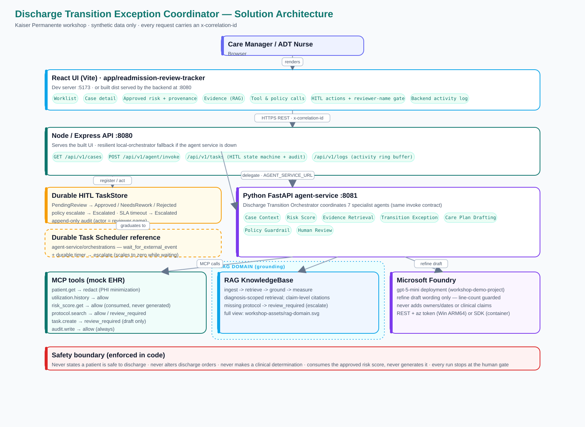
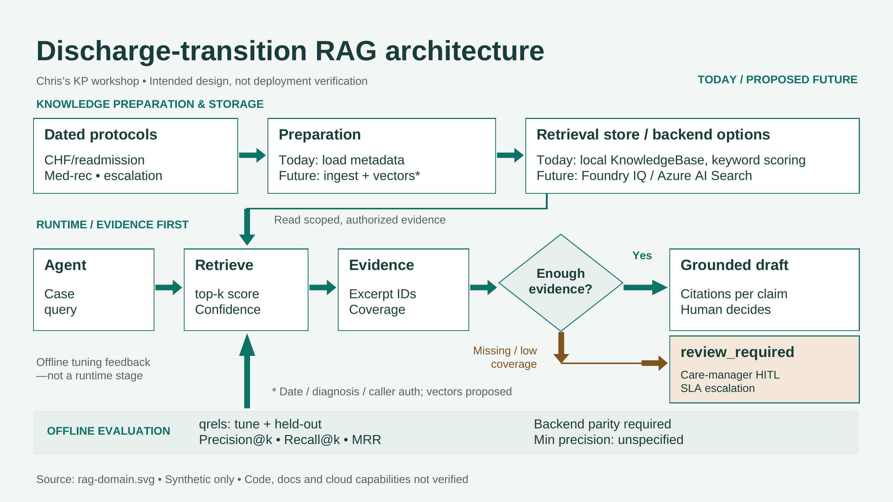
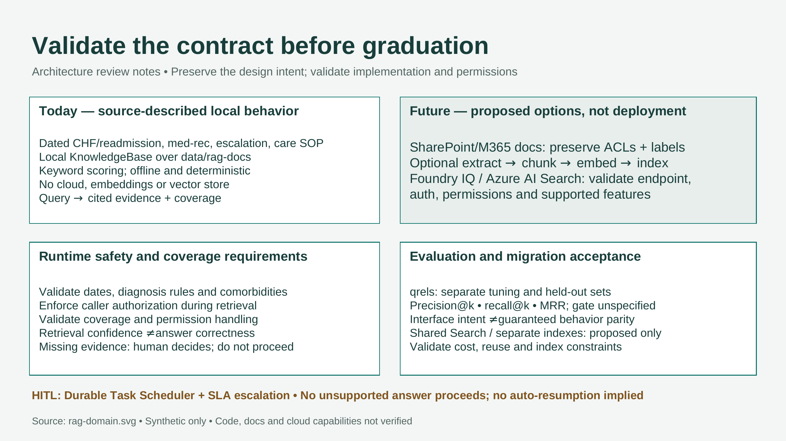
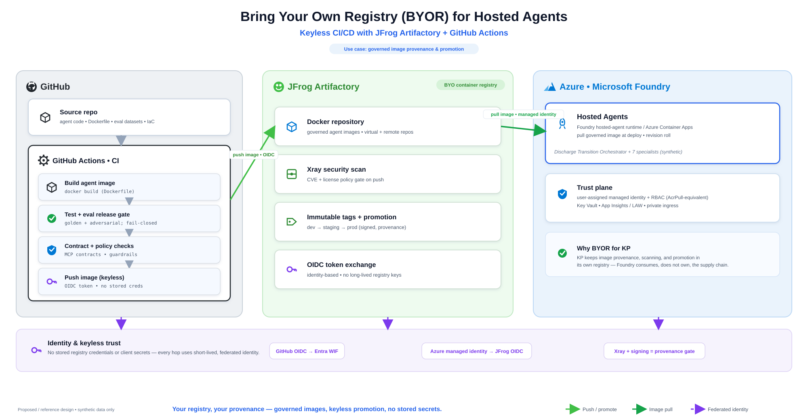

# Kaiser Readmissions Agent Workshop

Two-day onsite workshop for Kaiser Permanente teams designing secure, governed, observable healthcare agent patterns with Microsoft Foundry, Hosted Agents, BYO Registry, MCP/Work IQ, Foundry IQ/RAG, Application Insights, Log Analytics Workspace, human-in-the-loop review, and toolboxes.

## Scenario

The running scenario is a **Discharge Transition Exception Coordinator** for care managers and ADT nurses. The agent consumes an approved risk score from a deterministic tool, summarizes minimum-necessary synthetic context, retrieves effective-dated transition protocols, identifies actionable discharge-transition gaps, drafts owner/due-time recommendations, and routes an exception packet for human review.

The assistant must not:

1. State that a patient is safe to discharge.
2. Alter discharge orders.
3. Make clinical determinations.
4. Share patient-specific details outside approved workflows.
5. Turn a draft transition-exception packet into action without human approval.
6. Generate, infer, recalculate, or override the approved risk score.

All sample data is synthetic. Do not use real PHI in this workshop repo unless Kaiser Permanente governance explicitly approves the environment and data-handling process.

## Architecture



The reference implementation is a three-tier app plus a governed data/model layer:

- **React UI** (`app/readmission-review-tracker`) — worklist, case detail, approved-risk context, RAG evidence, tool/policy calls, the HITL review actions (with a required reviewer-name gate), and a live backend activity log.
- **Node/Express API** (`backend`, port 8080) — serves the built UI, exposes cases/invoke/tasks/logs, holds the durable HITL task store and audit trail, and delegates agent work to the Python service (with a resilient local-orchestrator fallback).
- **Python FastAPI agent-service** (`agent-service`, port 8081) — the Discharge Transition Orchestrator coordinating 7 specialist agents behind the same invoke contract, calling mock MCP tools and the RAG KnowledgeBase, and using Microsoft Foundry only to refine draft wording.

Every request carries an `x-correlation-id`. The full write-up is in `docs/solution-architecture-overview.md`; the diagram source is `workshop-assets/build_arch_diagram.py`.

### RAG domain

The grounding subsystem is a first-class domain, not a single box: **prepare knowledge → handle a
case (retrieve → evidence → enough? → grounded draft *or* `review_required`) → offline evaluation**,
with diagnosis-scoping, claim-level citations, and missing-evidence escalation. This is an
**intended design (synthetic data only)** — retrieval rules, the local-`KnowledgeBase` → Foundry IQ /
Azure AI Search backend swap, and the minimum precision threshold are **validation items**. The
retrieval **flow** is in `docs/rag-retrieval-flow.md`.



**Readiness checklist** — what to validate before graduating from local retrieval to a cloud backend
(behavior/contract parity, permissions, evaluation gates):




## Run it locally

The solution runs as two (optionally three) processes.

```powershell
# Terminal 1 — Python agent-service (multi-agent orchestrator)  :8081
cd .\agent-service
python -m venv .venv; .\.venv\Scripts\pip install -r requirements.txt
.\.venv\Scripts\python.exe -m uvicorn discharge_transition_agent.app:app --app-dir src --host 127.0.0.1 --port 8081

# Terminal 2 — Node backend + built UI  :8080
cd .\backend
npm install
$env:AGENT_SERVICE_URL = "http://127.0.0.1:8081"   # omit to use the local-orchestrator fallback
npm start        # http://127.0.0.1:8080
```

Rebuild the UI after changing it (the backend serves the built `dist`):

```powershell
cd .\app\readmission-review-tracker
npm install
npm run build
# or, for hot reload during UI work: npm run dev  (http://127.0.0.1:5173, proxies /api to :8080)
```

One-shot local validation (repo scaffold + frontend build + backend smoke test):

```powershell
.\scripts\validate-solution.ps1
```

## Deploy to Azure + Foundry

Infrastructure as code lives in `infra/terraform/`. See `infra/README.md`.

```powershell
cd .\infra\scripts
.\deploy.ps1        # provisions Azure + Foundry, builds image, deploys the app
```

## Workshop agenda

| Day | Focus | Modules |
| --- | --- | --- |
| Day 1 | Secure foundation and governed data access | Introduction, Hosted Agents, BYO Registry, MCP/Work IQ, compliance policy, guardrails, Foundry IQ/RAG |
| Day 2 | Operational readiness | LAW/App Insights, HITL Data Task Scheduler, toolboxes, end-to-end flow, evaluation and release gates |

## Repository layout

```text
kaiser-readmissions-agent-workshop/
├── docs/                 # Architecture, governance, data dictionary, facilitator guide
├── lab-guide/            # Participant-facing modules
├── data/                 # Synthetic data generator and RAG source documents
├── fabric/               # Fabric notebooks, DAX, and KQL starter assets
├── agents/               # Hosted-agent starter contract and instructions
├── agent-service/        # Python FastAPI multi-agent orchestrator + MCP tools + RAG + HITL store
│                         #   (src/, tests/, eval/ retrieval harness, orchestrations/ DTS reference)
├── backend/              # Node.js/Express API + HITL task store + activity log + local orchestrator
├── mcp-server/           # MCP tool contracts and future implementation surface
├── governance/           # Governance plan, approval matrix, tool permissions
├── observability/        # Trace scenarios, failure injection, runbook
├── policy/               # Guardrails, PHI minimization, prohibited claims, test prompts
├── hitl/                 # Data Task Scheduler schemas and state machine
├── evaluation/           # Golden cases, adversarial cases, judge rubric, calibration set
├── app/                  # React UI (discharge transition review tracker)
├── Dockerfile            # Single image: backend API + built UI
├── infra/                # Terraform for Azure + Foundry, deploy/destroy scripts
├── scripts/              # Setup and validation scripts
└── workshop-assets/      # Agenda, decks, run-of-show, facilitator runbook
```

## Prerequisites

Participant prerequisites depend on which labs are enabled:

1. Microsoft Fabric workspace for data foundation, semantic model, Fabric IQ, Data Agent, and notebooks.
2. Microsoft Foundry access for hosted-agent concepts and evaluation workflows.
3. Azure subscription for Azure AI Search, Application Insights, Log Analytics Workspace, Container Registry, and supporting resources.
4. GitHub or Azure DevOps repository for CI/CD discussions.
5. Synthetic data only for hands-on labs.

## First setup

Generate local synthetic CSVs:

```powershell
python .\data\generate_synthetic_healthcare_data.py --output .\data\synthetic
```

Run the backend API (local orchestrator stub):

```powershell
cd .\backend
npm install
npm start
# http://127.0.0.1:8080/api/health
```

Run repository validation:

```powershell
.\scripts\validate.ps1
```

## Workshop storyline

Day 1: Build the agent.

Day 2: Earn the right to trust it.

Use one evolving synthetic use case across all modules: a multi-agent discharge-transition exception coordinator that retrieves, summarizes, consumes an approved risk score, cites protocols, detects transition gaps, drafts an exception packet, validates policy, and routes work for human review.

The specialist agents are:

1. Discharge Transition Orchestrator (coordinator)
2. Case Context Agent
3. Risk Score Agent
4. Evidence Retrieval Agent
5. Transition Exception Agent
6. Care Plan Drafting Agent
7. Policy Guardrail Agent
8. Human Review Agent

## Architecture overview

See the [Architecture](#architecture) section above for the diagram, or `docs\solution-architecture-overview.md` for the complete write-up.

Diagram artifacts:

1. `workshop-assets\architecture-diagram.svg` (embedded above) and its generator `workshop-assets\build_arch_diagram.py`
2. `workshop-assets\architecture-overview.svg` / `.excalidraw` (earlier context diagram)

## Workshop decks & build log

- `workshop-assets\foundry-phase2-facilitator-deck.pptx` — the main 2-day facilitator deck.
- `workshop-assets\foundry-phase2-build-addendum.pptx` — **as-built** supporting slides, one per
  shipped work item (HITL/Data Task Scheduler, observability trace, evaluation gate + live demo).
  Regenerate with `node workshop-assets\decks\build-addendum-deck.js` (see `decks\README.md`).
- `workshop-assets\build-log.md` — the running play: what shipped, its live demo, and the slide added.
  Every shipped capability appends a row here and a slide in the addendum deck.

## Human-in-the-loop (Data Task Scheduler)

The review gate is a durable task store with a full state machine
(`PendingReview → Approved / NeedsRework / Rejected`; policy escalation and SLA timeout →
`Escalated`) and an append-only audit trail keyed on the reviewer name. It is implemented in both
services with an identical contract (`agent-service/src/discharge_transition_agent/hitl.py` and
`backend/src/hitl/taskStore.js`) and exposed at `/api/v1/tasks`. The Durable Task Scheduler
graduation target ships as reference code in `agent-service/orchestrations/`. Full details:
`docs\hitl-durable-task-scheduler.md`.

## MCP server (governed tool boundary)

The seven clinical tools run behind a governed MCP boundary with two transports from the same code
(`mcp-server/server.py`):

- **Local stdio** (default) — launched as a subprocess; zero infra.
- **Remote HTTP** — deployable as an **internal-ingress** Azure Container App
  (`infra/terraform/mcp.tf`, `enable_mcp_server=true`), private to the environment/VNet.

The agent uses the tools in-process by default and can route to the hosted server via
`USE_EXTERNAL_MCP` + `MCP_SERVER_URL`. **Work IQ** (Microsoft's governed M365 work-context service)
is consumed as a **separate lane** — Entra delegated / on-behalf-of only, `enable_workiq=true` — never
merged with the clinical tools. See `mcp-server/README.md` and `docs/work-iq-overview.md`.

## BYO Registry (BYOR) for Hosted Agents

The BYO Registry module lets Kaiser keep image **provenance, scanning, and promotion** in its own
registry (JFrog Artifactory): GitHub Actions builds, tests, and gates the agent image, then pushes it
to Artifactory with **keyless OIDC**; Microsoft Foundry Hosted Agents / Azure Container Apps pull the
governed image using a **managed identity**. Every hop uses short-lived, federated identity — no
stored registry credentials. This aligns with the workshop's keyless-CI posture (OIDC / Workload
Identity Federation; see `docs/retrospective-cloud-activation.md`).



> Proposed / reference design (synthetic data only). Diagram source:
> `workshop-assets/build_byor_diagram.py` (SVG + PNG). The module is scaffolded; a separate local
> sample repo will be incorporated when it is built.

## License

License is not yet selected. Do not redistribute externally until a license and notice strategy are approved.
