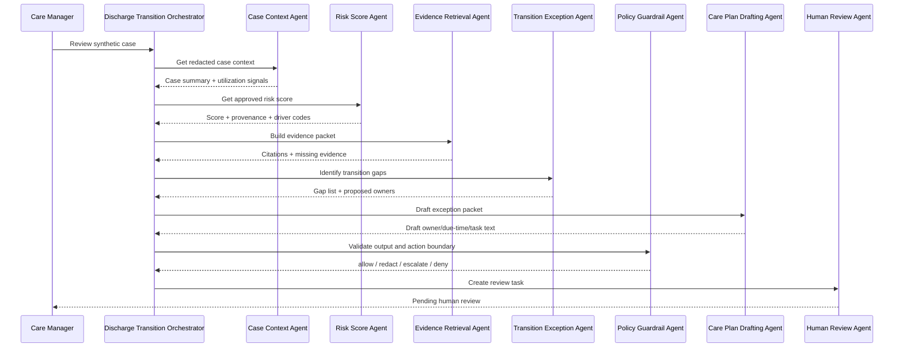

# Multi-Agent Orchestration

## Goal

The workshop should demonstrate a coordinated care operations workflow, not a single monolithic agent. Each specialist agent has a narrow responsibility, explicit inputs and outputs, and observable handoffs.

## Agent roster

| Agent | Role | Owns | Must not do |
| --- | --- | --- | --- |
| Discharge Transition Orchestrator | Coordinates the workflow and routes work to specialists | Plan, state, correlation ID, final exception packet | Bypass specialist gates or human review |
| Case Context Agent | Summarizes synthetic case context through governed tools | Redacted case summary, utilization snapshot | Return full notes or unnecessary details |
| Risk Score Agent | Retrieves an approved risk score and provenance | Score, timestamp, model/source provenance, driver codes | Recalculate, infer, or override risk |
| Evidence Retrieval Agent | Builds RAG evidence packet | Foundry IQ/approved source retrieval, citations, missing evidence | Invent guidance or ignore source metadata |
| Policy Guardrail Agent | Evaluates safety, PHI, citations, and workflow constraints | Policy decisions, redaction, refusal/escalation | Approve clinical or operational actions |
| Transition Exception Agent | Identifies incomplete transition elements | Medication, follow-up, pending-result, DME, service, transportation, language, social-support, referral, and task gaps | Determine clinical significance or discharge readiness |
| Care Plan Drafting Agent | Drafts owner, due-time, and task/outreach text | Draft exception packet, proposed owners, missing information | Present plan as final or clinically determinative |
| Human Review Agent | Creates and tracks HITL review task state | Task state, reviewer actions, audit trail | Approve on behalf of a human |

## Orchestration flow



## Handoff contract

Every specialist output should include:

```json
{
  "correlationId": "trace-kp-0147-a92f",
  "caseId": "P0147",
  "agentName": "evidence-retrieval-agent",
  "status": "completed",
  "summary": "Evidence packet assembled with two citations.",
  "outputs": {},
  "policySignals": [],
  "nextRecommendedAgent": "care-plan-drafting-agent"
}
```

## Teaching points

1. Multi-agent orchestration increases clarity and observability, but also increases coordination and evaluation requirements.
2. Each agent should be small enough to test independently.
3. The orchestrator should coordinate and assemble, not silently override specialist policy decisions.
4. Handoffs are first-class telemetry events.
5. Human review remains a separate control, not another autonomous agent approval.
