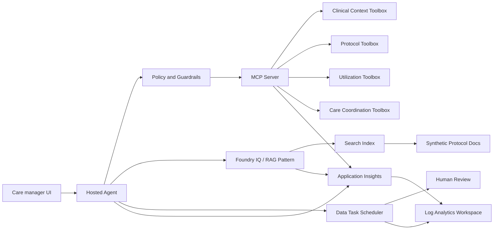

# Architecture

## Reference pattern

## Design principles

1. Agents reason over evidence; tools perform bounded work.
2. MCP is the control plane for tool access.
3. RAG responses cite approved sources or disclose missing evidence.
4. Policy is layered across input, retrieval, tools, generation, output, and approval.
5. Human review is required before follow-up actions.
6. Observability captures behavior, quality, safety, cost, latency, and approval flow.
7. Registry and deployment controls are part of the release process, not an afterthought.

## Trust boundaries

| Boundary | Purpose |
| --- | --- |
| User identity | Captures who initiated the workflow. |
| Agent identity | Grants only required access to tools and telemetry. |
| MCP tool identity | Separates data access from model reasoning. |
| RAG index boundary | Restricts grounding to approved sources. |
| HITL boundary | Prevents autonomous operational action. |
| Registry boundary | Controls image provenance and release promotion. |

