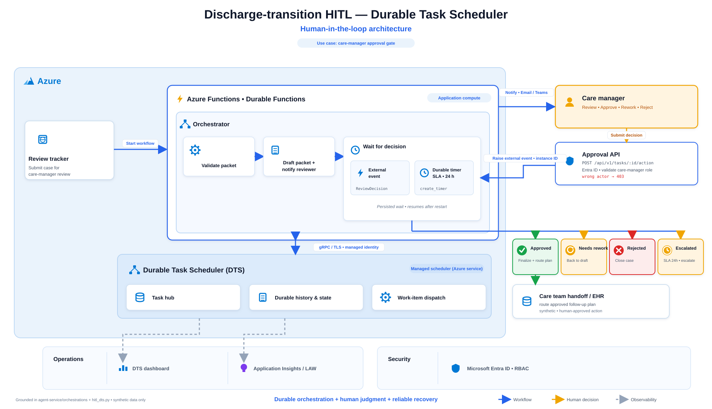
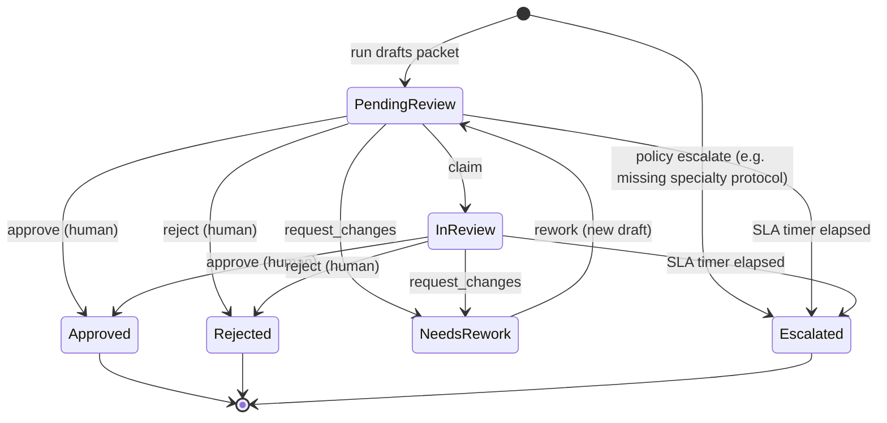

# HITL with the Durable Task Scheduler (Data Task Scheduler)

**Agenda item:** (Human in the loop) HITL — Data Task Scheduler
**Pattern source:** Microsoft Agent Framework **Durable Extension**, hosted on **Azure Functions**
with the **Durable Task Scheduler** backend.

This chapter shows Kaiser Permanente how a human-approval gate should be built for agentic
workflows: not an in-memory flag, but a **durable orchestration** that pauses on an external event,
survives restarts, escalates on a timer, and audits every transition. The workshop ships two
implementations of the *same* contract:

> Architecture diagram source: `workshop-assets/build_dts_hitl_diagram.py` (SVG + PNG). Synthetic
> data only; icons are simplified glyphs in the Azure palette, not the official product icons.

| | Local store (runnable) | Durable Task Scheduler (target) |
| --- | --- | --- |
| Code | `agent-service/src/discharge_transition_agent/hitl.py` | `agent-service/orchestrations/function_app.py` |
| Wait mechanism | file-backed task + `sweep` | `wait_for_external_event` + durable `create_timer` |
| Decision delivery | `POST /api/v1/tasks/{id}/action` | `client.raise_event("ReviewDecision")` |
| Persistence | JSON file (`.hitl-store.json`) | Durable Task Scheduler task hub |
| Compute while waiting | process idle | **scales to zero** |
| Runs in the lab? | ✅ offline | ❌ needs Functions host + DTS |

The states, actions, human-only guard, and audit record are **identical** across both, so the local
store is a faithful teaching mirror and the graduation path is a swap, not a rewrite.

## The use case

The Discharge Transition Exception Coordinator consumes an **approved** risk score, retrieves
protocol evidence, and drafts an exception packet. It then **stops** at a care-manager approval
gate. The agent may draft and rework only; a human owns Approve and Reject.

## State machine

**Rules (enforced in code, not just prompts):**

1. Only a human reviewer can move a task to `Approved` or `Rejected` (`actor` required; agents blocked).
2. The agent can create and rework drafts only.
3. Every transition writes an append-only audit record: `{timestamp, from, to, action, actor, note}`.
4. A task past its review SLA auto-escalates — a forgotten review never becomes a silent approval.
5. A policy escalation on the run (e.g. P0310, missing specialty protocol) creates the task already
   `Escalated`, routing straight to a specialist.

## API (local store)

| Method & path | Purpose |
| --- | --- |
| `POST /api/v1/agent/invoke` | Run the agents; registers a durable review task keyed by `correlationId`. |
| `GET /api/v1/tasks` | List review tasks (sweeps overdue first). |
| `GET /api/v1/tasks/{id}` | One task with its full history. |
| `GET /api/v1/tasks/{id}/audit` | Just the audit trail. |
| `POST /api/v1/tasks/{id}/action` | Apply `claim` / `approve` / `request_changes` / `reject` / `escalate` / `rework`. Body `{action, actor, note}`. |
| `POST /api/v1/tasks/sweep` | Force the timer→escalate sweep (demo fast-forward). |

Illegal transitions return `409`; a missing `actor` on approve/reject returns `403`; unknown tasks
return `404` — the same guardrails the durable orchestration enforces.

## Demo script (chapter 05)

1. Invoke **P0147** → a `PendingReview` task appears with a due time.
2. Try `approve` with `actor: agent` → **403** (only a human approves).
3. `approve` as `care-manager` → `Approved`, audit shows two entries.
4. Invoke **P0310** → task is created **`Escalated`** (policy escalation, not a routine review).
5. Invoke a case, then `POST /tasks/sweep` with a short `HITL_SLA_SECONDS` → watch it **auto-escalate**.
6. Open `orchestrations/function_app.py` and show the **same** branches as `wait_for_external_event`
   + `create_timer`, and that compute is **zero** while the real orchestration waits.

## Configuration

| Env var | Meaning | Default |
| --- | --- | --- |
| `HITL_SLA_SECONDS` | Review SLA before auto-escalation | `86400` (24h) |
| `HITL_STORE_PATH` | Where the durable task file lives | `agent-service/.hitl-store.json` |

## Why the Durable Task Scheduler (the "so what")

- **Governance:** approvals become durable, replayable, audited events — reconstructable after the fact.
- **Reliability:** a host restart mid-review loses nothing; any worker resumes the run.
- **Safety:** timeout→escalate and the human-only guard live in the workflow, not in a UI handler.
- **FinOps:** waiting for a human for a week costs nothing to wait on — measured in the observability
  chapter, not assumed.
