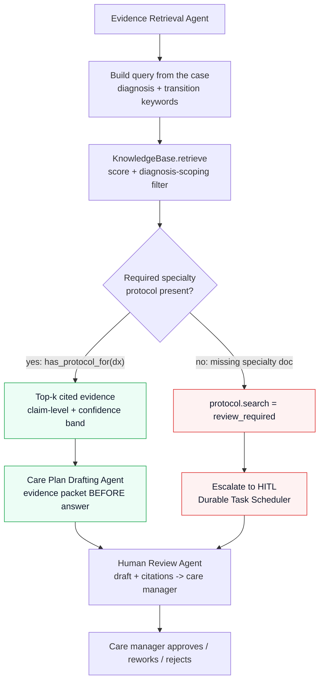
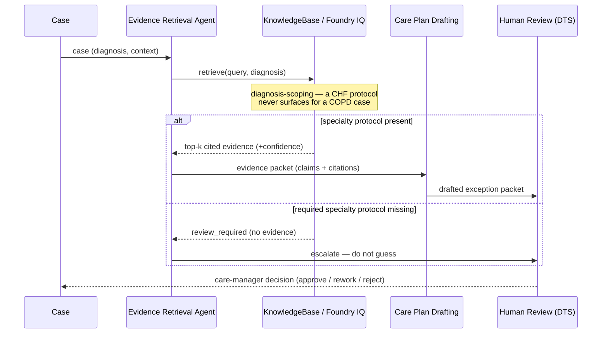

# RAG retrieval flow — grounded, cited, escalated

How the agent turns a case into a **cited, grounded** answer — or, when evidence is missing, a
**human-review escalation instead of a guess**. Grounded in
`agent-service/src/discharge_transition_agent/knowledge.py` (retrieval + diagnosis-scoping) and the
Evidence Retrieval / Care Plan / Human Review specialists. See the visual companion
`workshop-assets/rag-domain.svg` and the deck's Foundry IQ + RAG slide.

## The happy path and the escalation path

## As a sequence

## Why this is the point (not a demo trick)

1. **Evidence packet before answer.** Retrieval runs first and produces claims + citations; the draft
   is written *from* that packet, not the model's memory.
2. **Diagnosis-scoping.** `knowledge.py` only lets a diagnosis-specific document surface for its own
   diagnosis (`_detect_specialty` + the scoping filter in `retrieve`), so a CHF protocol can't ground
   a COPD case.
3. **Missing evidence escalates.** When a required specialty protocol is absent
   (`has_protocol_for(dx)` is false), `protocol.search` returns `review_required` and the workflow
   routes to the human gate instead of proceeding on general guidance.
4. **Measured, not vibes.** The retrieval eval harness (`agent-service/eval/evaluate_retrieval.py`,
   `qrels.jsonl`) scores precision@k / recall@k / MRR and can gate on a minimum — measure retrieval
   *before* tuning prompts (the GPT-RAG accelerator pattern).
5. **Same contract on graduation.** Swapping the local `KnowledgeBase` for Foundry IQ / Azure AI
   Search keeps the `query -> cited evidence + coverage signal` contract, so the agents don't change.

## References

- `docs/rag-guidance-gpt-rag.md` · `docs/rag-development-patterns.md` · `docs/existing-vs-foundry-search.md`
- `docs/capability-host-reuse-and-cost.md` (reuse + cost on graduation)
- `workshop-assets/rag-domain.svg` (the RAG domain / pipeline diagram)
