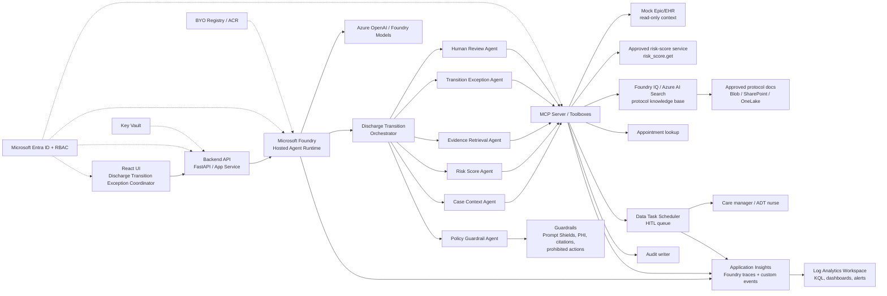

# Solution Architecture Overview

## Purpose

This architecture supports the workshop use case: **Discharge Transition Exception Coordinator**.

The solution demonstrates how a governed multi-agent system can assemble minimum-necessary context, consume an approved risk score, ground transition requirements in approved knowledge, identify discharge-transition exceptions, draft owner/due-time recommendations, and stop at a human approval gate.

## High-level architecture

## Layer responsibilities

| Layer | Responsibility |
| --- | --- |
| React UI | Shows synthetic discharge candidates, approved risk-score context, transition gaps, evidence, draft exception packet, HITL state, and trace cues. |
| Backend API | Future API boundary for UI, workflow state, and calls to hosted agent endpoints. |
| Hosted Agent Runtime | Runs the code-first multi-agent workflow with managed endpoint, identity, scale, and traces. |
| Orchestrator | Coordinates specialist agents, preserves correlation ID, and assembles final review package. |
| Specialist agents | Case context, risk-score retrieval, evidence retrieval, transition gap detection, policy validation, and human review tasking. |
| MCP/toolboxes | Typed, governed tool boundary for data access, task creation, audit, and telemetry. |
| Foundry IQ / RAG | Retrieves approved effective-dated transition protocols with citation metadata. |
| Guardrails | Enforces prohibited behaviors, PHI minimization, citation requirements, prompt/document attack handling, and HITL boundaries. |
| HITL | Ensures executable actions remain pending until a qualified human approves, edits, rejects, escalates, or requests rework. |
| Observability | Captures traces, events, policy decisions, tool calls, evaluation results, alerts, and dashboards. |

## Critical safety boundary

The system may draft a transition-exception packet, but it must not:

1. Decide discharge readiness.
2. Make a clinical determination.
3. Interpret clinical significance of pending results.
4. Change discharge, medication, or treatment orders.
5. Generate, infer, recalculate, or override the approved risk score.
6. Execute patient-impacting actions without human approval.

## Data flow

1. User opens a synthetic discharge candidate in the React UI.
2. UI calls backend API with case ID and actor context.
3. Backend invokes the Foundry hosted agent endpoint.
4. Orchestrator starts a correlation ID and invokes specialists.
5. Case Context Agent gets minimum-necessary case data through MCP.
6. Risk Score Agent calls `risk_score.get` for deterministic approved risk score and provenance.
7. Evidence Retrieval Agent queries Foundry IQ / Azure AI Search for protocol evidence.
8. Transition Exception Agent identifies missing transition elements and proposed owners.
9. Policy Guardrail Agent validates PHI, citations, prohibited claims, and HITL requirements.
10. Human Review Agent creates a task in the HITL queue.
11. Reviewer approves, edits, rejects, escalates, or requests rework.
12. Application Insights and Log Analytics capture the full trace.

## Deployment concepts

| Concern | Workshop pattern |
| --- | --- |
| Agent packaging | Hosted Agent image or source package; BYO Registry sample to be integrated later. |
| Identity | Microsoft Entra ID for users, agent identity, project identity, tool/resource access. |
| Secrets | Key Vault; no secrets in code, prompt, or repo. |
| Data | Synthetic only; PHI-shaped but fictional. |
| RAG | Approved protocols with metadata, citations, and missing-evidence behavior. |
| Observability | Server-side Foundry traces first, custom OpenTelemetry events for app/tool/HITL paths. |
| Evaluation | Golden, adversarial, missing-evidence, tool-denial, PHI, HITL-bypass, and risk-score override tests. |

## Diagram artifacts

- Editable diagram: `workshop-assets/architecture-overview.excalidraw`
- SVG export: `workshop-assets/architecture-overview.svg`

