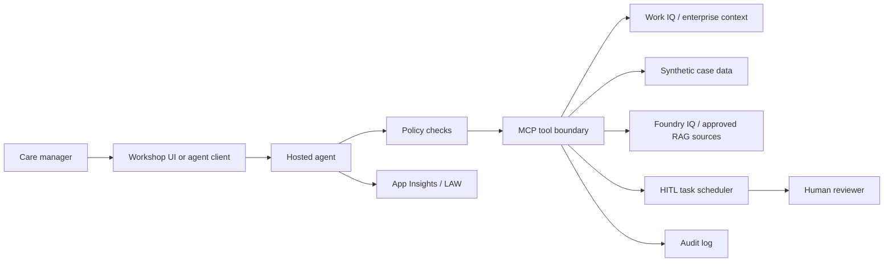

# Trust Boundaries

## Boundary model

## Key rules

1. The LLM does not directly access enterprise systems.
2. Tools enforce authorization before returning data.
3. Case context is carried in every healthcare tool call.
4. Retrieved content is treated as data, not as instructions.
5. Draft actions are separated from approved actions.
6. Human approval is represented as structured state.
7. Telemetry includes correlation IDs across agent, retrieval, tools, policy, and HITL.

## Access envelope

Every tool call should carry:

| Field | Purpose |
| --- | --- |
| `correlationId` | End-to-end workflow trace. |
| `actorId` | Human or system actor initiating the request. |
| `agentIdentity` | Agent identity used at runtime. |
| `caseId` | Synthetic patient/case scope. |
| `purpose` | Why access is needed. |
| `action` | Read, draft, create task, write audit, etc. |
| `dataScope` | Redacted, aggregate, excerpt, expanded, privileged. |
| `policyDecision` | Allow, deny, redact, escalate, review required. |

