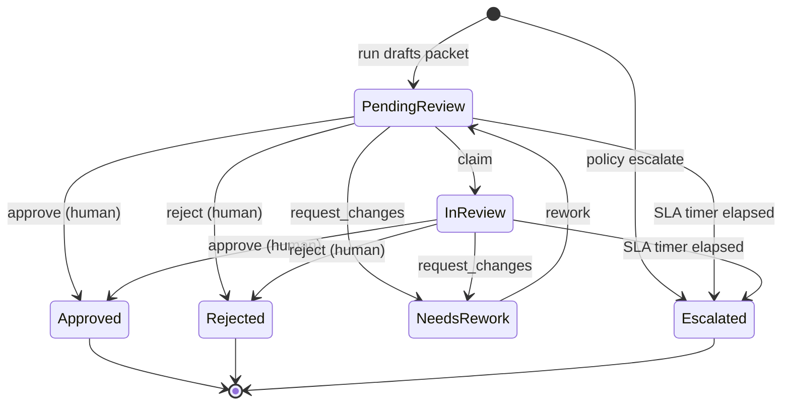

# HITL State Machine

> Implemented as a durable review-task store in `agent-service/src/discharge_transition_agent/hitl.py`
> (runnable, file-backed) that mirrors the **Durable Task Scheduler** approval gate in
> `agent-service/orchestrations/function_app.py`. Full mapping, API, and demo script:
> `docs/hitl-durable-task-scheduler.md`.

## Rules

1. Only a human reviewer can move a task to `Approved` or `Rejected` (an `actor` is required; agents are blocked).
2. The agent can create drafts and rework drafts only.
3. Every transition requires an audit event (`{timestamp, from, to, action, actor, note}`).
4. A task past its review SLA auto-escalates on `sweep` — a forgotten review never becomes a silent approval.
5. A policy escalation on the run creates the task already `Escalated`, routing straight to a specialist.

