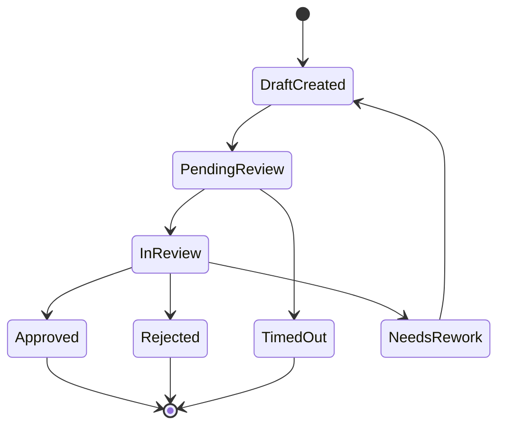

# HITL State Machine

## Rules

1. Only a human reviewer can move a task to `Approved` or `Rejected`.
2. The agent can create drafts and rework drafts only.
3. Every transition requires an audit event.
4. Timed-out tasks require escalation.

