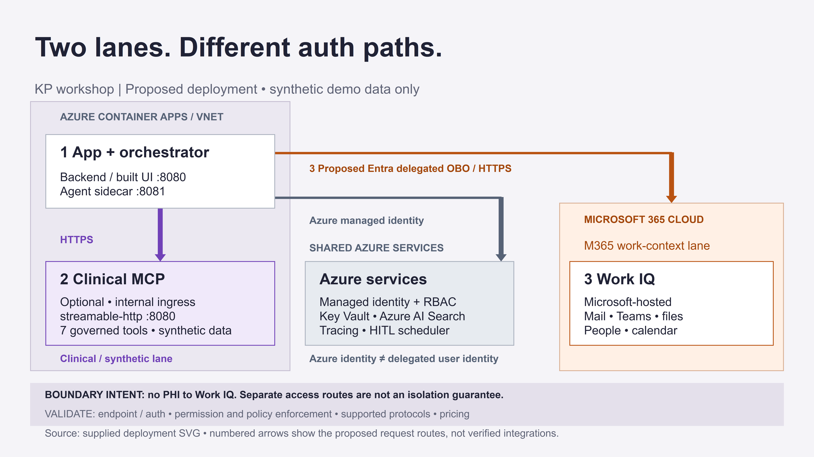
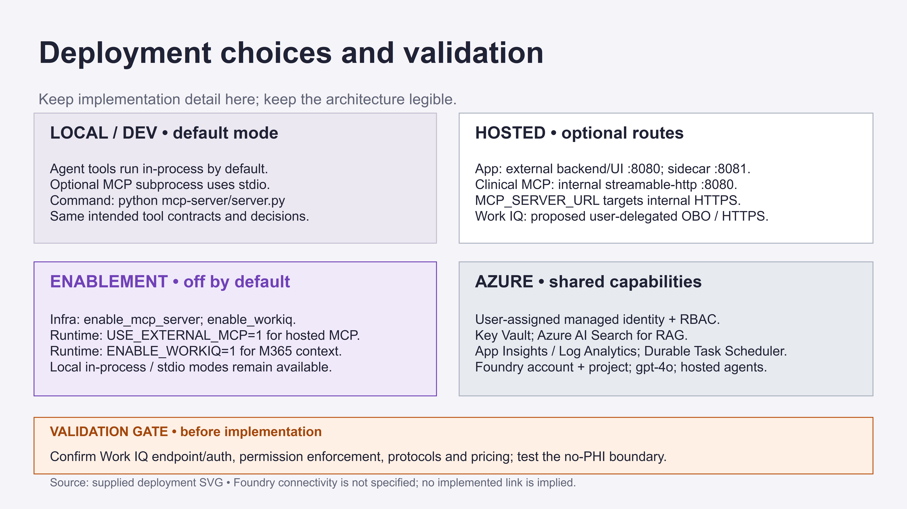

# MCP connections

Two lanes, different identity rules — the clinical MCP route (our governed tools, synthetic data) and
the Work IQ route (Microsoft-hosted M365 context, proposed Entra delegated / on-behalf-of). This is a
**proposed** architecture: Work IQ endpoint/auth, permission enforcement, supported protocols, and
pricing — and the *no-PHI-to-Work-IQ* boundary — are **validation items**, not guarantees.

**Architecture — what talks to what:**

**Deployment choices and validation:**

| File | Server | Lane | Who runs it |
| --- | --- | --- | --- |
| `clinical.mcp.json` | `discharge-transition-clinical` (this repo's `server.py`) | **Clinical / PHI tools** | We build and govern it |
| `workiq.mcp.json` | Microsoft **Work IQ** (`workiq-local` / `workiq-remote`) | **M365 work context** | Microsoft — we consume it |

## The design

- **Clinical / PHI data → our own governed MCP server.** The seven tools with contracts, scopes,
  redaction, read-only risk score, draft-only task creation, and always-on audit. This is where
  regulated patient data flows.
- **M365 work context → Work IQ's MCP.** The surrounding, non-clinical collaboration context a care
  manager legitimately touches (a coordination Teams thread, a discharge-planning meeting summary, a
  SharePoint SOP) — reached on the user's identity with labels, DLP, and an OPA policy engine.

Both honor the same identity-first rule. Work IQ means we **don't build or secure an M365-context
server ourselves**. See `docs/work-iq-overview.md` for the full, source-grounded brief.

## Running

- **Clinical server** (offline, synthetic): `pip install -r ../requirements.txt` then
  `python ../server.py`. Any MCP-capable client can launch it via `clinical.mcp.json`.
- **Work IQ** requires **tenant sign-in** and cannot run offline. `workiq-local` needs the `workiq`
  CLI installed; `workiq-remote` needs a delegated/OBO Entra token. Confirm the current remote
  endpoint and scopes against Microsoft Learn (linked in the brief) before wiring into Foundry as a
  project connection.

## Wiring into the agent

The agent-service consumes the clinical tools **in-process by default** (identical governed logic).
To route through the external MCP server instead, set `USE_EXTERNAL_MCP=1` (see
`agent-service/src/discharge_transition_agent/mcp_client.py`). Two transports are chosen
automatically:

- **Hosted HTTP:** when `MCP_SERVER_URL` is set (the deployed internal Container App), calls go over
  the streamable-http transport.
- **Local stdio:** otherwise `server.py` is launched as a subprocess.

Work IQ is added as a **separate** connection alongside the clinical server, never merged with it.
Its agent seam is `agent-service/src/discharge_transition_agent/workiq_client.py`, gated by
`ENABLE_WORKIQ` and requiring an Entra delegated / on-behalf-of user token at request time (no
app-only auth). See `docs/work-iq-overview.md`.

## Hosted deployment (Azure)

`enable_mcp_server=true` deploys the clinical server as an internal-ingress Container App
(`infra/terraform/mcp.tf`); `enable_workiq=true` advertises the Work IQ endpoint to the app/agent
(no resource is provisioned — Work IQ is Microsoft-hosted and consumed via OBO). Deploy both with
`infra\scripts\deploy.ps1 -EnableMcpServer` and the relevant tfvars.
